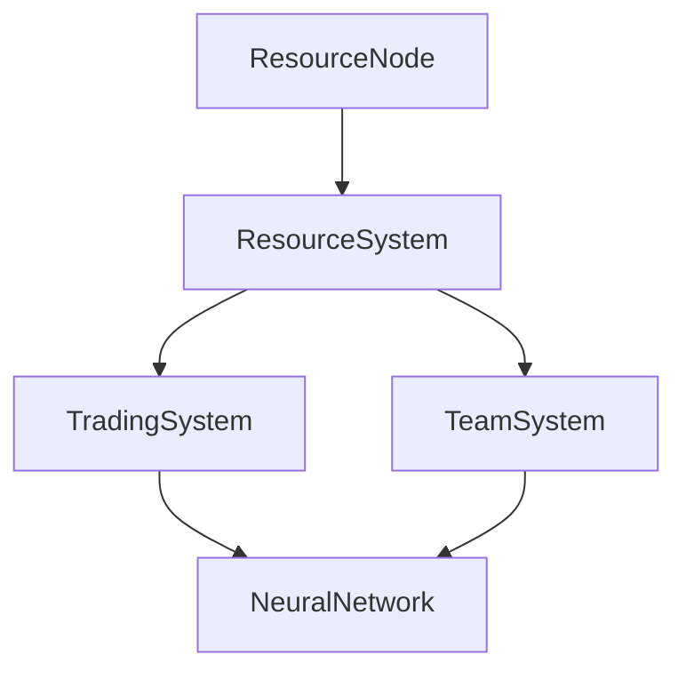
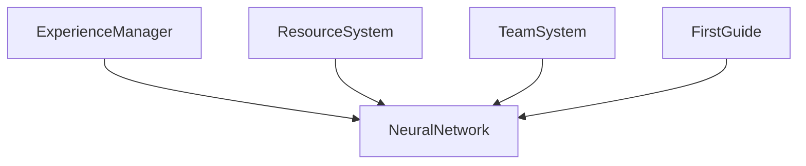
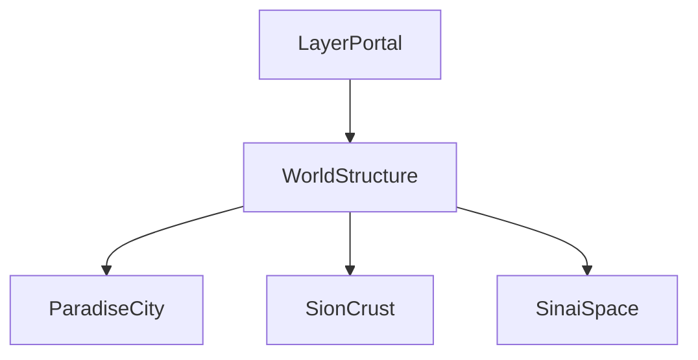

# Code Structure Documentation

## Overview

REcreation Of Space is organized into several key systems that work together to create the game experience.

## Core Systems

### 1. World Structure
- `WorldStructure.cs`: Defines the layered world (Sion's Crust, Paradise City, Sinai Space)
- `WorldGenerator.cs`: Handles terrain and world generation
- `LocalTerrainGenerator.cs`: Manages local terrain details
- `ParadiseCity.cs`: Controls the Sinai sanctuary at the epicenter
- `MountSinai.cs`: Manages the mountain and transcendence mechanics

### 2. Character Systems
- `NeuralNetwork.cs`: Handles consciousness development
- `ExperienceManager.cs`: Manages experience gains
- `SinaiCharacter.cs`: Base character behavior
- `SionObserver.cs`: Interaction with Sion elements
- `FirstGuide.cs`: Tutorial and guidance system
- `GuiderSystem.cs`: Advanced guidance mechanics

### 3. Resource System
- `ResourceSystem.cs`: Core resource management
- `ResourceNode.cs`: Individual resource points
- `TradingSystem.cs`: Resource exchange between characters
- `TeamSystem.cs`: Group resource sharing

### 4. UI System
- `ResourceUI.cs`: Resource interface
- `TeamUI.cs`: Team management interface
- `NeuralNetworkUI.cs`: Consciousness development display
- `GuiderMessageUI.cs`: In-game messages
- `ScreenFade.cs`: Transition effects
- `PortalPromptUI.cs`: Layer transition interface

### 5. Setup and Initialization
- `TopDownGameSetup.cs`: Main game initialization
- `GameInitializer.cs`: Core systems setup
- `PrefabCreator.cs`: Runtime object creation
- `UIElementCreator.cs`: UI system initialization

## System Interactions

### Resource Flow

### Character Development

### World Layer Management

## Key Concepts

### 1. Neural Network Development
The consciousness system is built around the `NeuralNetwork` class, which:
- Tracks development progress
- Manages consciousness nodes
- Handles experience distribution
- Integrates with all other systems

### 2. Resource Management
Resources are managed through multiple layers:
- Collection (`ResourceNode`)
- Storage (`ResourceSystem`)
- Exchange (`TradingSystem`)
- Sharing (`TeamSystem`)

### 3. World Layers
The game world is divided into distinct layers:
- Sion's Crust (surface layer)
- Paradise City (Sinai sanctuary)
- Sinai Space (expansion area)

## Adding New Features

When adding new features:

1. Identify the appropriate system
2. Follow existing patterns
3. Integrate with `WorldStructure`
4. Update UI as needed
5. Add necessary documentation

## Best Practices

1. System Integration
- Use events for cross-system communication
- Maintain loose coupling
- Follow dependency injection patterns

2. Performance
- Use object pooling for frequent instantiation
- Optimize resource gathering calculations
- Manage UI updates efficiently

3. Code Style
- Follow Unity naming conventions
- Document public methods
- Use regions for organization
- Keep methods focused and concise

## Testing

Test new features across all layers:
1. Surface functionality
2. Integration with existing systems
3. Performance impact
4. UI responsiveness
5. Cross-layer interactions

## Future Considerations

When extending the codebase:
1. Maintain the philosophical aspects
2. Consider the Sion/Sinai dynamic
3. Support consciousness development
4. Enable community features
5. Allow for world expansion
